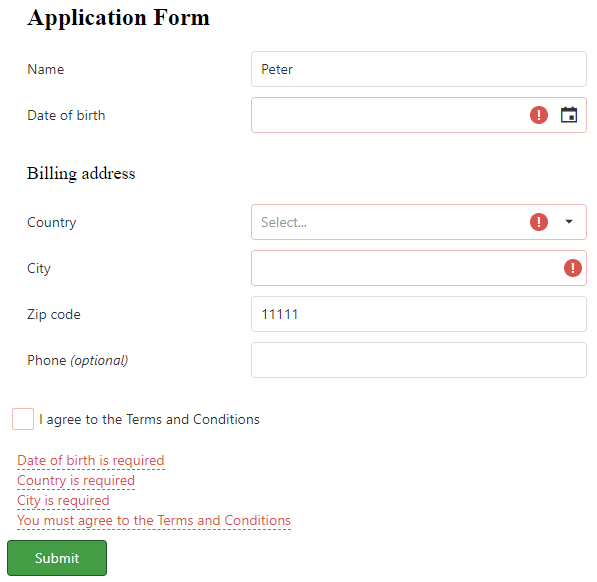

<!-- default badges list -->

<!-- default badges end -->

#  DevExtreme Validator - How to display validation errors only on a button click

This example illustrates how to avoid validating an editor after its value was changed. Validation is performed on a button click only. The main idea is to extend the default adapter and override the <a href="https://js.devexpress.com/Documentation/ApiReference/UI_Widgets/dxValidator/Configuration/adapter/#bypass">bypass</a> function to complete this task. For this, create a global variable to determine if validation was raised on a button click. 

<!-- run online -->
**[[Run Online]](https://codecentral.devexpress.com/128584732/)**
<!-- run online end -->

## Files to Review

- **JS**
    - [Validator.js](./JS/Validator.js)

## Documentation

- [Validator - API Reference](https://js.devexpress.com/Documentation/ApiReference/UI_Components/dxValidator/)
